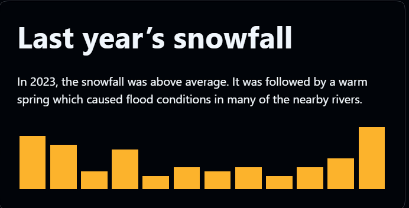

# ASTs, Markdown and MDX

#### What is MDX?&#x20;

* allow markdown content in JSX , import comp. such as interactive charts or alerts, and embed them within your content

```mdx
import {Chart} from './snowfall.js'
export const year = 2023

# Last year’s snowfall

In {year}, the snowfall was above average.
It was followed by a warm spring which caused
flood conditions in many of the nearby rivers.

<Chart color="#fcb32c" year={year} />
```

<figure><figcaption></figcaption></figure>

#### How does a file with Markdown get converted into HTML, and how does MDX get converted into JSX?

* Prettier use Abstract Syntax Tree (AST) to format the ugly Js to formatted Markdown, so AST is the middle man&#x20;
* How it works:
  * using Level 1 Heading and a paragraph
  * if process  with [unified](https://unified.js.org/) along with the [remark-parse](https://github.com/remarkjs/remark/tree/master/packages/remark-parse) plugin, input = markdown , result : AST which represents the Markdown

```
Markdown -> AST -> HTML
Markdown -> AST -> Formatted Markdown
Markdown -> AST -> Lint Errors
Markdown -> AST -> Word Counts
```

```markdown
# Welcome

A paragraph.
```

```js
import unified from "unified";
import markdown from "remark-parse";

const input = `
# Welcome

A paragraph.
`;

const tree = unified()
  .use(markdown)
  .parse(input);
```

Components in AST :

* **type**: What data type is this node? Heading, Paragraph, Emphasis, Strong, etc.
* **children**: Nested nodes contained within the current one. Imagine an Image inside of a Link, or a Link within a Paragraph
* **depth**: Used to differentiate Level 1, 2, 3 Headings (h1, h2, h3)
* **value**: Text nodes have a value attribute which contain their actual text value

```json
{
  "type": "root",
  "children": [
    {
      "type": "heading",
      "depth": 1,
      "children": [
        {
          "type": "text",
          "value": "Welcome"
        }
      ]
    },
    {
      "type": "paragraph",
      "children": [
        {
          "type": "text",
          "value": "A paragraph."
        }
      ]
    }
  ]
}
```

#### Using the AST for Calculations

```js
function counts(acc, node) {
  // add 1 to an initial or existing value
  acc[node.type] = (acc[node.type] || 0) + 1;

  // find and add up the counts from all of this node's children
  return (node.children || []).reduce(
    (childAcc, childNode) => counts(childAcc, childNode),
    acc
  );
}
```

```json
{
  "root": 1,
  "heading": 1,
  "text": 7,
  "paragraph": 3,
  "strong": 1,
  "emphasis": 1
}
```

Using AST can also create your own wordcount functionand React component called Node which renders it and its children (using padding to display its tree like structure&#x20;

#### Counting Words:

```js
import unified from "unified";
import markdown from "remark-parse";

function wordCount(count, node) {
  if (node.type === "text") {
    return count + node.value.split(" ").length;
  } else {
    return (node.children || []).reduce(
      (childCount, childNode) => wordCount(childCount, childNode),
      count
    );
  }
}

// Our markdown input
const input = `## Welcome`;

// Convert markdown into an AST
const tree = unified()
  .use(markdown)
  .parse(input);

// Extract Word Count from AST
const words = wordCount(0, tree);
```

#### Visualizing the AST <a href="#visualizingtheast" id="visualizingtheast"></a>

```jsx
const Node = ({ node }) => (
  <div style={{ paddingLeft: `15px` }}>
    <strong>
      {node.type}
      {node.depth && <span> (d{node.depth})</span>}
    </strong>

    {node.value && <div style={{ paddingLeft: "15px" }}>{node.value}</div>}

    {/* Render additional Nodes for each child */}
    {node.children &&
      node.children.map(child => {
        const { line, column, offset } = child.position.start;
        return <Node key={`${line}-${column}-${offset}`} node={child} />;
      })}
  </div>
);
```

Output:

```
root
  heading (d1)
    text
      Welcome
  paragraph
    text
      A paragraph.
```
